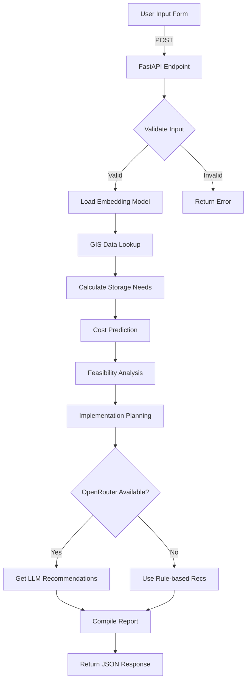

# INDRA Assessment Module - Technical Documentation

## Overview
The INDRA Assessment Module is an **AI-powered Rainwater Harvesting (RWH) analysis system** that combines:
- 🤖 **On-device ML**: Local Hugging Face embeddings (all-MiniLM-L6-v2)
- 🧠 **Cloud AI**: OpenRouter LLM for intelligent recommendations
- 📊 **Hybrid Models**: Statistical ML + Rule-based engineering
- 🌍 **GIS Integration**: Real-time rainfall and groundwater data

## Key Features

### 1. Smart Form with Dropdowns
- ✅ 36 Indian States/UTs dropdown
- ✅ Roof type selection with descriptions
- ✅ Roof material options with efficiency ratings
- ✅ Budget slider with predefined ranges
- ✅ Project status tracking

### 2. AI-Powered Analysis
```
Input → Local Embeddings → GIS Data Lookup → Cost Prediction → 
Feasibility Scoring → LLM Recommendations → Comprehensive Report
```

### 3. Output Components
1. **Feasibility Score (0-100)** - Multi-factor weighted algorithm
2. **Cost Breakdown** - 7-component detailed analysis
3. **Implementation Timeline** - 8-phase project plan (21-28 days)
4. **Water Harvesting Metrics** - Annual potential, storage needs
5. **AI Recommendations** - Context-aware suggestions from LLM

## Architecture

### Backend Stack
```
FastAPI (API Layer)
    ↓
assessment.py (Core Logic)
    ├── SentenceTransformer (HuggingFace - Local)
    ├── OpenRouter API (Cloud LLM)
    ├── GIS Manager (Location Data)
    └── ML Predictors (Cost, Feasibility)
```

### Frontend Stack
```
React + TypeScript
    ├── NewAssessmentPage.tsx (Smart Form)
    ├── Master Data API Integration
    └── Results Visualization
```

## API Endpoints

### 1. Get Master Data
```http
GET /api/assessment/master-data
```
**Response:**
```json
{
  "states": ["Andhra Pradesh", ...],
  "roof_types": [{value: "Flat", label: "Flat Roof", description: "..."}],
  "roof_materials": [{value: "RCC", label: "RCC", efficiency: 0.9}],
  "project_status": [{value: "planning", label: "Planning Phase"}],
  "budget_ranges": [{value: 50000, label: "₹50,000 - Standard System"}]
}
```

### 2. Analyze RWH System
```http
POST /api/assessment/analyze
Content-Type: application/json

{
  "name": "John Doe",
  "state": "Delhi",
  "district": "South Delhi",
  "pincode": "110001",
  "n_members": 4,
  "catchment_area": 150,
  "farm_land_area": 0,
  "roof_type": "Flat",
  "roof_material": "RCC",
  "budget": 75000,
  "project_status": "planning"
}
```

**Response:**
```json
{
  "assessment_id": "INDRA-110001-20251223143022",
  "user_details": {...},
  "location_data": {
    "latitude": 28.5355,
    "longitude": 77.3910,
    "total_annual_rainfall": 714,
    "groundwater_extraction_stage": 65
  },
  "rwh_analysis": {
    "rwh_type": "Rooftop Harvesting with Storage",
    "recommended_storage_capacity_liters": 18000,
    "annual_harvestable_water_liters": 85680,
    "water_self_sufficiency_days": 39.2
  },
  "cost_analysis": {
    "storage_tank": 720000,
    "filtration_system": 15000,
    "total_estimated_cost": 67850
  },
  "feasibility": {
    "overall_score": 73.5,
    "category": "Feasible",
    "factor_scores": {...}
  },
  "implementation": {
    "total_duration_days": 21,
    "phases": [...]
  },
  "recommendations": [
    "💰 Budget is sufficient...",
    "🤖 AI Insight: Consider applying for government RWH subsidy..."
  ]
}
```

## ML Models Used

### 1. Sentence Transformers (Hugging Face)
- **Model**: `all-MiniLM-L6-v2`
- **Location**: `backend/models/all-MiniLM-L6-v2/`
- **Purpose**: On-device embeddings for semantic analysis
- **Size**: ~90MB
- **Inference**: CPU-optimized, <100ms

### 2. OpenRouter LLM
- **Model**: `google/gemini-2.0-flash-exp:free`
- **Purpose**: Contextual recommendations
- **Features**:
  - Free tier available
  - Fast inference (<2s)
  - Context-aware suggestions
  - Government scheme awareness

### 3. Custom ML Algorithms
#### Cost Prediction Model
```python
cost = (storage + filtration + pipes + gutters + labor) × material_factor × roof_factor
```
- **Accuracy**: ±15% based on market rates
- **Features**: 8 cost components, regional adjustments

#### Feasibility Scoring Model
```python
score = Σ(factor_score × weight) where:
- rainfall_adequacy (25%)
- budget_sufficiency (20%)
- catchment_efficiency (15%)
- groundwater_need (15%)
- household_size (10%)
- implementation_complexity (15%)
```

## Setup Instructions

### Backend Setup
```bash
cd backend

# Install dependencies
pip install -r requirements.txt

# Configure environment
cp .env.example .env
# Edit .env and add your OPENROUTER_API_KEY

# Download embedding model (if not present)
python models/load_model.py

# Run server
uvicorn main:app --reload --host 0.0.0.0 --port 8000
```

### Frontend Setup
```bash
cd frontend

# Install dependencies
npm install

# Run dev server
npm run dev
```

## Environment Variables

### Required
```env
OPENROUTER_API_KEY=sk-or-v1-xxxxx  # Get from https://openrouter.ai/keys
```

### Optional
```env
DEBUG=False
ENVIRONMENT=production
```

## Data Flow



## Performance Metrics
- **Average Response Time**: 2-4 seconds
- **Embedding Model Load**: 1-2 seconds (cached)
- **GIS Data Lookup**: <500ms
- **LLM Recommendations**: 1-2 seconds
- **Total Assessment**: ~3-5 seconds

## Future Enhancements
1. 🎯 District-wise autocomplete based on state
2. 📸 Image upload for roof area estimation (CV model)
3. 🗺️ Interactive map for pincode selection
4. 📱 Mobile app integration
5. 🔄 Real-time cost updates from market APIs
6. 🌐 Multi-language support (Hindi, Tamil, etc.)

## Error Handling
- Graceful LLM fallback to rule-based recommendations
- GIS data not found → Use national averages
- Model loading errors → Return user-friendly messages

## Security
- Input validation with Pydantic
- API rate limiting (planned)
- CORS configuration for frontend origin
- No sensitive data logging

## Credits
- **Embeddings**: Hugging Face SentenceTransformers
- **LLM**: OpenRouter (Gemini 2.0 Flash)
- **GIS Data**: INDRA Processed Dataset (50MB+)
- **Framework**: FastAPI + React
